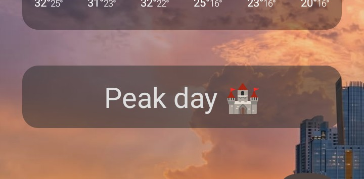

# Календарь Niconson 🗓️ 

(9-дневный цикл, 12-летний цикл)
Компактный и удобный виджет для Android, который выводит текущий тип дня (название или статус дня) из вашего календаря прямо на рабочий стол смартфона. Данные запрашиваются в фоновом режиме с сервера через API и обновляются как автоматически по таймеру, так и вручную по тапу на виджет.



Проект состоит из двух частей:
1. Бэкенд-скрипт, развернутый на платформе Vercel.
2. Готовый файл конфигурации для Android-приложения **HTTP Shortcuts**, который выводит данные в текстовый виджет переменной.

---

## 🚀 Как установить и настроить виджет на Android

Чтобы не настраивать JavaScript-скрипты и переменные вручную, вы можете импортировать уже готовую конфигурацию из этого репозитория.

### Шаг 1. Установка приложения
1. Скачайте и установите бесплатное приложение **Ярлыки HTTP-запросов** (в Google Play оно называется [HTTP Shortcuts](https://google.com)).

### Шаг 2. Импорт конфигурации
1. Скачайте файл `shortcuts.json` из этого репозитория на свой телефон.
2. Откройте приложение **HTTP Shortcuts**.
3. Откройте боковое меню (или нажмите три точки в правом верхнем углу) и выберите пункт **Импорт/Экспорт** (Import / Export).
4. Нажмите **Импортировать из файла** (Import from file) и выберите скачанный `.json` файл.
5. *Готово!* В приложении автоматически появится настроенный запрос к API календаря и переменная `day` со скриптом очистки JSON.

### Шаг 3. Вынос виджета на рабочий стол
1. Выйдите на рабочий стол Android, зажмите пальцем пустой экран и откройте меню **Виджеты**.
2. Найдите в списке приложение **HTTP Shortcuts** и выберите тип виджета **«Виджет переменной»** (Variable Widget).
3. Перетащите его на экран. В открывшемся окне настроек:
   * Выберите переменную **`day`**.
   * В самом низу в поле **When clicked, run shortcut** (При клике запускать ярлык) нажмите и выберите ярлык **`Календарь`** (или `Календарь Niconson`).
4. Сохраните настройки виджета (галочка в верхнем углу).

---

## 🔄 Как это работает
* **Обновление по тапу:** Просто нажмите на виджет на рабочем столе. Он отправит скрытый запрос на сервер, получит свежие данные и мгновенно обновит текст.
* **Автообновление:** В настройках ярлыка включено периодическое выполнение (Periodic Execution), которое раз в час в фоновом режиме опрашивает сервер и обновляет дату, не расходуя заряд батареи.

> **Совет:** Чтобы Android не усыплял фоновое обновление виджета, зайдите в настройки телефона -> *Приложения* -> *HTTP Shortcuts* -> *Батарея* -> выберите режим **Не ограничивать** (Unrestricted).

---

## 🛠️ Спецификация API
Виджет делает обычный `GET` запрос по адресу:
`https://calendar-api-niconson.vercel.app/api/today?offset=5`

Обратите внимание , что в конце запроса есть параметр `offset=5`, который означает сдвиг часового пояса. Измените этот параметр в настройках приложения **HTTP Shortcuts**, если сдвиг по вашему часовому поясу отличается от этого значения, чтобы переключение дня происходило в 00:00 по вашему времени.

**🌍 Пример ответа сервера (JSON):**
```json
{
  "dayname":"Peak day 🏰",
  "date":"2026-07-28",
  "offsetreceived":2,
  "debuginfo":"OK"
}
```
Встроенный в ярлык JavaScript автоматически парсит этот ответ, вытаскивает значение ключа и выводит на экран чистый текст без скобок и кавычек.

---

## ⚖️ Лицензия и Авторство
Проект распространяется под лицензией Apache 2.0. 

**[Узнать больше о календаре Niconson](https://niconson.com/calendar)**.
